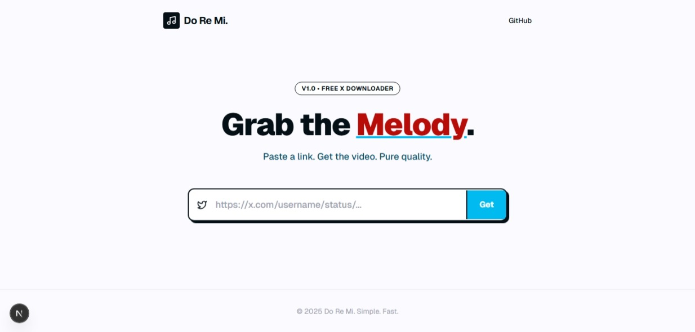

# 🎵 Do Re Mi | X Media Downloader

> **"Grab the Melody. Keep the Quality."**

**Do Re Mi** is a minimalist, high-performance web application designed to download videos and images from X (formerly Twitter) in **Original Quality (4K/HD)**. 

Built with a focus on privacy and speed—**no login required**, no ads, just pure utility wrapped in a bold, Gen-Z aesthetic.



---

## ✨ Key Features

* **🔓 No Login Required:** Bypass X's login wall. Just paste the link.
* **💎 Original Quality:** Fetches the highest bitrate video available (up to 4K) directly from the source.
* **⚡ Auto-Rename:** Automatically names downloaded files as `DoReMi_Video_[Username]_[ID].mp4` for better organization.
* **🎨 Minimalist "Canvas" UI:** A clean, brutalist-inspired design that focuses on content, not clutter.
* **📱 Mobile Optimized:** Works perfectly on desktop, tablets, and mobile devices.

---

## 🛠️ Tech Stack

* **Framework:** [Next.js 14](https://nextjs.org/) (App Router)
* **Styling:** [Tailwind CSS](https://tailwindcss.com/)
* **Animations:** [Framer Motion](https://www.framer.com/motion/)
* **Icons:** [Lucide React](https://lucide.dev/)
* **API Method:** Server-side proxy using FxTwitter/FixupX public endpoints.

---

## 🚀 Getting Started

### Prerequisites

Ensure you have **Node.js** (v18+) installed on your machine.

### Installation

1.  **Clone the repository:**
    ```bash
    git clone https://github.com/yuridazani/do-re-mi.git
    cd do-re-mi
    ```

2.  **Install dependencies:**
    ```bash
    npm install
    ```

3.  **Run the development server:**
    ```bash
    npm run dev
    ```

4.  Open [http://localhost:3000](http://localhost:3000) in your browser.

---
## 🎨 Color Palette

| Color | Hex Code | Usage |
| :--- | :--- | :--- |
| **Ink Black** | `#040f16` | Primary Background & Text |
| **Ghost White** | `#fbfbff` | Canvas Background |
| **Bright Sky** | `#01baef` | Primary Actions & Accents |
| **Brick Ember** | `#b80c09` | Error States & Highlights |
| **Yale Blue** | `#0b4f6c` | Secondary Elements |

---

## 📜 License

This project is open-source and available under the **MIT License**.

---

Crafted with ☕ and 🎶 by **[Yurida Zani](https://github.com/yuridazani)**.
